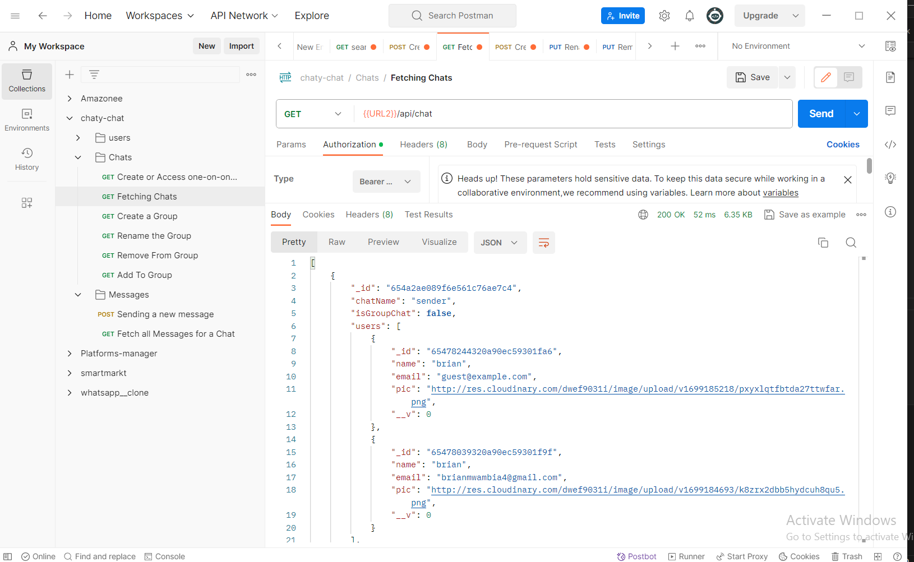

# Chat MERN App

A real-time chat application built with the MERN (MongoDB, Express.js, React, Node.js) stack.

## Table of Contents

- [Features](#features)
- [Technologies Used](#technologies-used)
- [Installation](#installation)

## Features

- Real-time messaging
- User authentication
- MongoDB for data storage
- Express.js for backend API
- React for the frontend
- Node.js for server-side logic

## Technologies Used

- MongoDB
- Express.js
- React
- Node.js
- Socket.io (for real-time communication)
- [Other dependencies, if any]

## Installation

1. Clone the repository:

```bash
git clone https://github.com/MwambiaBrian/chat-mern-app.git
cd chat-mern-app
# Install server dependencies
cd server
npm install

# Install client dependencies
cd ../client
npm install


Set up MongoDB:

Create a MongoDB Atlas account or set up a local MongoDB database.
Configure the MongoDB connection in server/config/db.js.


```



